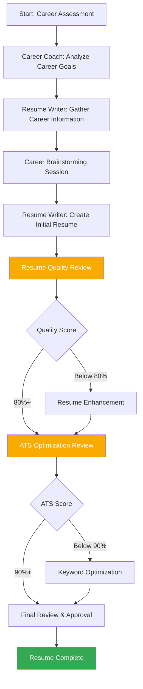

# Resume Creation Workflow

## Overview

This workflow guides users through the complete resume creation process, from initial career assessment to final document optimization. The process involves multiple agents working together to create a compelling, ATS-optimized resume.

## Workflow Diagram

## Workflow Steps

### Phase 1: Career Assessment & Planning

**Agent: Career Coach**

1. **Career Goals Analysis**
   - Understand target roles and industries
   - Identify career objectives and timeline
   - Assess current career situation

2. **Skills Assessment**
   - Evaluate current skills and competencies
   - Identify skill gaps and development needs
   - Determine transferable skills

3. **Career Strategy Development**
   - Create career development plan
   - Identify target companies and roles
   - Develop networking strategy

### Phase 2: Information Gathering

**Agent: Resume Writer**

1. **Career Information Collection**
   - Gather work history and achievements
   - Collect education and certifications
   - Identify relevant projects and accomplishments

2. **Career Achievement Brainstorming**
   - Facilitate achievement identification
   - Help quantify accomplishments
   - Develop compelling career narratives

3. **Industry Research**
   - Identify relevant keywords and terminology
   - Research industry best practices
   - Understand role-specific requirements

### Phase 3: Resume Creation

**Agent: Resume Writer**

1. **Initial Resume Draft**
   - Create professional summary
   - Develop work experience section
   - Organize skills and competencies
   - Format education and certifications

2. **Content Optimization**
   - Apply achievement-focused writing
   - Include relevant keywords
   - Ensure ATS compatibility
   - Optimize for target roles

### Phase 4: Quality Assurance

**Agent: Resume Writer**

1. **Resume Quality Review**
   - Apply resume quality checklist
   - Identify improvement opportunities
   - Ensure professional standards

2. **Content Enhancement**
   - Strengthen weak sections
   - Improve achievement descriptions
   - Enhance professional summary
   - Optimize skills presentation

### Phase 5: ATS Optimization

**Agent: Resume Writer**

1. **Keyword Analysis**
   - Review target job descriptions
   - Identify relevant keywords
   - Ensure keyword integration

2. **Format Optimization**
   - Verify ATS compatibility
   - Check formatting standards
   - Ensure parseable content

### Phase 6: Final Review

**Agent: Resume Writer**

1. **Comprehensive Review**
   - Final quality assessment
   - ATS compatibility verification
   - Professional presentation check

2. **User Approval**
   - Present final resume
   - Gather user feedback
   - Make final adjustments

## Agent Responsibilities

### Career Coach

- **Primary Role**: Career strategy and planning
- **Key Tasks**:
  - Career goals analysis
  - Skills assessment
  - Career strategy development
  - Networking guidance

### Resume Writer

- **Primary Role**: Resume creation and optimization
- **Key Tasks**:
  - Information gathering
  - Resume drafting
  - Content optimization
  - Quality assurance
  - ATS optimization

### Interview Coach

- **Primary Role**: Interview preparation (separate workflow)
- **Support Tasks**:
  - Resume-based interview preparation
  - Achievement story development
  - Response preparation

## Quality Gates

### Gate 1: Career Assessment Complete

- [ ] Career goals clearly defined
- [ ] Target roles identified
- [ ] Skills assessment completed
- [ ] Career strategy developed

### Gate 2: Information Gathering Complete

- [ ] Work history documented
- [ ] Achievements quantified
- [ ] Skills inventory completed
- [ ] Industry research conducted

### Gate 3: Initial Resume Complete

- [ ] Professional summary written
- [ ] Work experience documented
- [ ] Skills section organized
- [ ] Education included

### Gate 4: Quality Review Passed

- [ ] Resume quality score ≥ 80%
- [ ] All critical sections complete
- [ ] Professional standards met
- [ ] Content optimized

### Gate 5: ATS Optimization Complete

- [ ] ATS compatibility score ≥ 90%
- [ ] Keywords integrated
- [ ] Format optimized
- [ ] Parseable content verified

### Gate 6: Final Approval

- [ ] User approval received
- [ ] Final adjustments made
- [ ] Document ready for use

## Success Criteria

### Resume Quality

- **Content**: Achievement-focused, quantified results
- **Format**: Professional, ATS-compatible
- **Length**: Appropriate for experience level
- **Accuracy**: All information verified

### ATS Optimization

- **Keywords**: Relevant terms integrated
- **Format**: Parseable by ATS systems
- **Compatibility**: Works with major ATS platforms
- **Score**: 90%+ ATS compatibility

### User Satisfaction

- **Alignment**: Meets career goals
- **Confidence**: User feels prepared
- **Readiness**: Ready for job applications
- **Feedback**: Positive user response

## Risk Mitigation

### Common Issues

- **Incomplete Information**: Ensure thorough information gathering
- **Weak Achievements**: Focus on quantification and impact
- **ATS Issues**: Regular compatibility testing
- **User Dissatisfaction**: Regular feedback and iteration

### Mitigation Strategies

- **Iterative Process**: Regular reviews and updates
- **Quality Gates**: Multiple checkpoints for quality
- **User Feedback**: Continuous user involvement
- **Expert Review**: Professional standards application

## Timeline

### Standard Process: 2-3 Sessions

- **Session 1**: Career assessment and information gathering
- **Session 2**: Resume creation and initial optimization
- **Session 3**: Quality review and finalization

### Expedited Process: 1-2 Sessions

- **Session 1**: Quick assessment and resume creation
- **Session 2**: Quality review and optimization

### Comprehensive Process: 3-4 Sessions

- **Session 1**: Detailed career assessment
- **Session 2**: Information gathering and brainstorming
- **Session 3**: Resume creation and optimization
- **Session 4**: Quality review and finalization

## Deliverables

### Primary Deliverable

- **Professional Resume**: ATS-optimized, achievement-focused resume

### Supporting Deliverables

- **Career Assessment**: Career goals and strategy document
- **Skills Inventory**: Comprehensive skills assessment
- **Achievement List**: Quantified accomplishments
- **Keyword Analysis**: Industry-specific keywords

### Optional Deliverables

- **Cover Letter**: Tailored cover letter template
- **LinkedIn Profile**: Optimized LinkedIn summary
- **Interview Preparation**: Resume-based interview guidance
